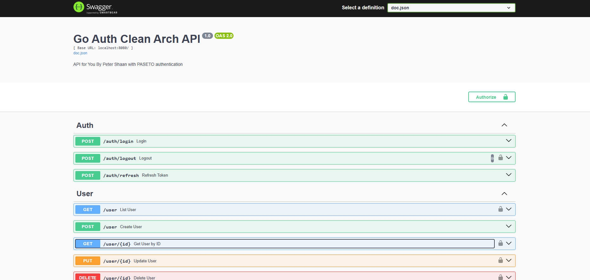

# go-auth-clean-arch by Peter Shaan



## Description

Golang Backend Application for user, role, and authentication management using Go, Echo, GORM, Goose, MySQL, Paseto, and Session Versioning.  
Built with Clean Architecture principles for scalability and maintainability.

## Features

- User & Role Management
- Authentication with Paseto Token
- Session Versioning
- RESTful API with Echo
- Database Migration using Goose
- Swagger API Documentation
- Modular Clean Architecture

## Project Structure

```
go-auth-clean-arch/
├── config.yml
├── go.mod, go.sum
├── LICENSE
├── main.go
├── README.md
├── internal/
│   ├── cmd/
│   │   ├── migrate.go
│   │   ├── root.go
│   │   └── serve.go
│   ├── controller/
│   │   ├── controller.go
│   │   └── user_controller.go
│   ├── helper/
│   │   ├── common_helper.go
│   │   ├── crypto_helper.go
│   │   └── helper.go
│   ├── middleware/
│   │   ├── db_middleware.go
│   │   ├── paseto_middleware.go
│   │   └── middleware.go
│   ├── repository/
│   │   ├── repository.go
│   │   └── user_repository.go
│   ├── routes/
│   │   ├── routes.go
│   │   ├── user_routes.go
│   │   └── auth_routes.go
│   ├── service/
│   │   ├── service.go
│   │   └── user_service.go
├── migrations/        # Goose migration files
├── package/
│   ├── external/
│   └── library/
│       ├── common.go
│       ├── config.go
│       ├── db.go
│       ├── echo.go
│       ├── library.go
│       └── logger.go
├── resource/
│   ├── constants/
│   │   ├── channel.go
│   │   └── default.go
│   ├── errors/
│   │   └── error.go
│   ├── model/
│   │   ├── common.go
│   │   ├── helper.go
│   │   ├── role.go
│   │   ├── user.go
│   │   └── validator.go
│   ├── rbac/
│   └── response/
│       └── common.go
```

## Installation

1. **Clone repository:**

   ```sh
   git clone https://github.com/petershaan12/go-auth-clean-arch
   cd go-auth-clean-arch
   ```

2. **Install dependencies:**

   ```sh
   go mod tidy
   ```

3. **Setup config:**

   - Copy `config.yml.example` ke root project sebagai `config.yml`
   - Edit isinya sesuai kebutuhan (DB, Paseto key, dll)

4. **Run server:**

   ```sh
   go run main.go serve
   ```

5. **Create migration:**

   ```sh
   goose -dir ./migrations create your_sql_name sql
   ```

6. **Run migration:**

   ```sh
   goose -dir ./migrations mysql "user:password@tcp(localhost:3306)/dbname" up
   ```

   **Or using migrate.go:**

   ```sh
   go run main.go migrate --direction=up
   ```

   **Rollback:**

   ```sh
   go run main.go migrate --direction=down
   ```

7. **View Swagger API Docs:**
   - Generate docs:
     ```sh
     swag init
     ```
   - Access Swagger UI:
     ```
     http://localhost:8080/swagger/index.html
     ```

## License

This project is licensed under the MIT License. See [LICENSE](./LICENSE) for details.
